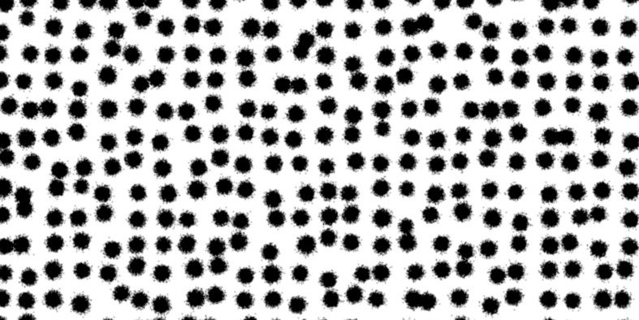
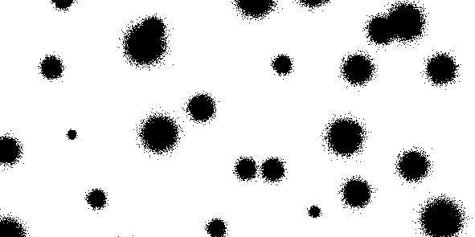

Generate print-ready images of a random speckle pattern for DIC applications.

#### Installation

This package is hosted on PyPI. Install it using `pip`:

```pip install speckle_pattern```


#### Example speckle pattern

```python
from speckle_pattern import generate_and_save

image_height = 50 # mm
image_width = 100 # mm
speckle_diameter = 3 # mm
dpi = 200
save_path = 'example.jpg'

generate_and_save(image_height, image_width, dpi, speckle_diameter, save_path)
```

<p align='center'></p>


#### More speckle generation options

```python
from speckle_pattern import generate_and_save

image_height = 50 # mm
image_width = 100 # mm
speckle_diameter = 7.5 # mm
dpi = 150
save_path = 'example2.tiff'

size_randomness = 0.9 # set higher for more speckle size variety
position_randomness = 2.5 # set higher for more speckle position variety
speckle_blur = 0. # sigma of smothing Gaussian kernel
grid_step = 2. # approximate grid step, in terms of speckle diameter `D`

generate_and_save(
    image_height, 
    image_width, 
    dpi, 
    speckle_diameter, 
    save_path,
    size_randomness=size_randomness,
    position_randomness=position_randomness,
    speckle_blur=speckle_blur,
    grid_step=grid_step,
    )
```

<p align='center'></p>

#### Example line pattern

```python
from speckle_pattern import generate_lines

image_height = 50 # mm
image_width = 100 # mm
line_width = 5 # mm
orientation = 'vertical'
dpi = 200
save_path = f'example_lines_{orientation}.jpg'

generate_lines(image_height, image_width, dpi, line_width, save_path)
```

<p align='center'></p>

### Authors

- [Domen Gorjup](http://ladisk.si/?what=incfl&flnm=gorjup.php)
- [Janko Slavič](http://ladisk.si/?what=incfl&flnm=slavic.php)
- [Miha Boltežar](http://ladisk.si/?what=incfl&flnm=boltezar.php)